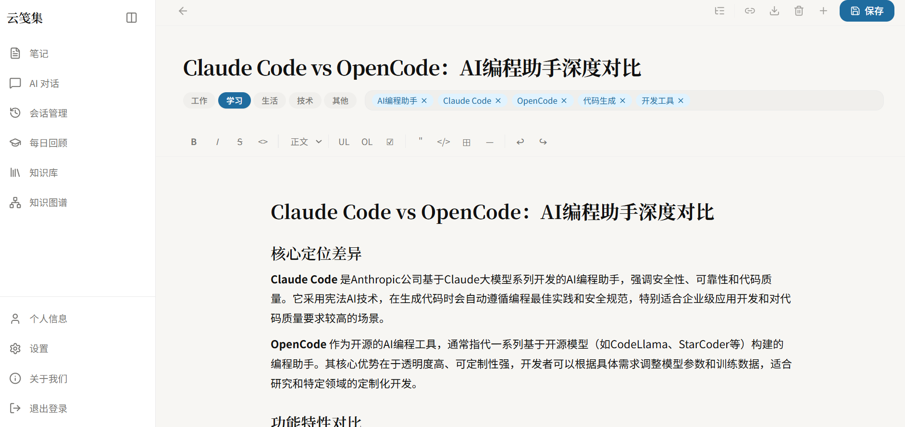
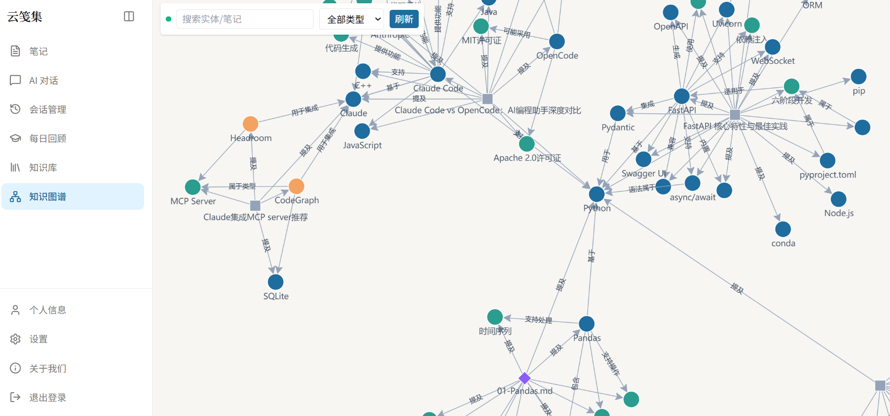
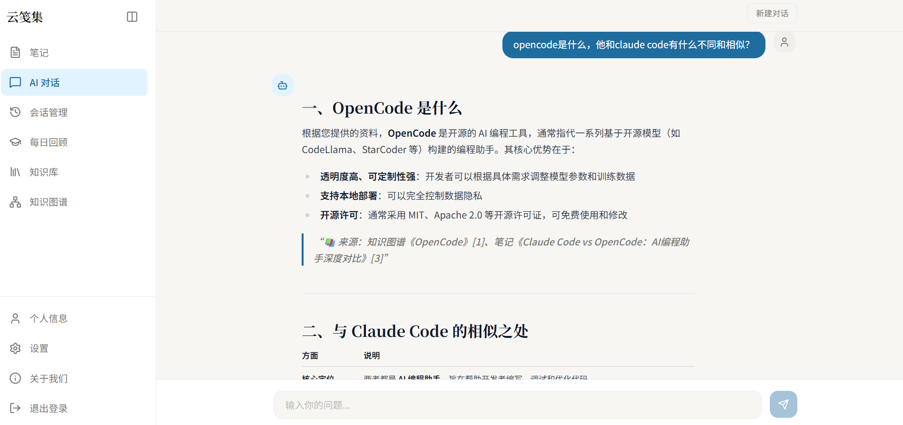

# RAG NoteBook— 智能笔记助手

<div align="center">
<a href="https://github.com/RMA-MUN/RAGNotebook/stargazers">
  
</a>
<a href="https://github.com/RMA-MUN/RAGNotebook/network/members">
  
</a>
  
  <a href="https://github.com/RMA-MUN/RAGNotebook/actions/workflows/ci.yml">
    
  </a>
</div>


AI 驱动的个人知识管理工具，融合 **笔记管理 + neo4j知识图谱 + GraphRAG + AI 写作辅助**，解决"笔记写了从不回看、知识散落成孤岛"的问题。

---

## 项目变迁

本项目最初是一个**基础 RAG 对话系统**，我们做了一次重要转型，从基础的 RAG，转型为解决实际问题的 RAG NoteBook：

| | 阶段一（base-rag 分支） | 阶段二（master 分支） |
|--|-----------------------|:--------------------|
| **定位** | 纯 RAG 对话服务，开箱即用 | 智能笔记助手，长期维护支持版本， Agentic RAG + KnowledgeGraph |
| **能力** | 文档上传 → 向量检索 → AI 问答（非GraphRAG） | 笔记管理 + 知识图谱 + RAG + AI 写作 |
| **适合谁** | 想快速集成 RAG 能力的开发者或希望学习RAG技术的个人 | 需要AI管理笔记和知识库的个人以及简历需要相关项目的求职者 |

**RAG 始终是整个系统的核心引擎。** 基础 RAG 代码已永久保留在 `base-rag` 分支供学习使用，如果只需要纯 RAG 服务，切换到`base-rag`即可开箱使用。

> 📄 [查看完整项目变迁 →](./docs/project_develop.md)

## 📋 目录

- [项目简介](#项目简介)
- [项目变迁](#项目变迁)
- [核心特性](#核心特性)
- [项目架构](#项目架构)
- [项目演示](#项目演示)
- [快速开始](#快速开始)
- [技术栈](#技术栈)
- [项目结构](#项目结构)
- [API 文档](#api文档)
- [配置说明](#配置说明)
- [部署指南](#部署指南)
- [开发指南](#开发指南)
- [故障排除](#故障排除)
- [联系方式](#联系方式)

## 项目简介

基于 **FastAPI + LangChain** 构建的智能笔记助手，核心能力包括：

- **RAG 知识库**：多格式文档上传（txt/pdf/md/pptx/docx），自动构建知识图谱，图谱引导的混合检索问答
- **笔记管理**：Markdown 编辑器、笔记自动写入知识图谱、智能标签（LLM 自动分类）、语义搜索、Markdown 导出
- **间隔重复回顾**：艾宾浩斯遗忘曲线算法，对抗遗忘
- **AI 写作辅助**：联机补全、续写/扩写/摘要、关联笔记推荐

系统支持会话持久化（MySQL）、向量检索（Neo4j 知识图谱）、JWT 用户隔离，前端采用React+Tailwind CSS构建现代化界面。

## 核心特性

- **📝 笔记管理**：Markdown 编辑器，支持新建、编辑、删除、分类筛选、分页列表
- **🏷️ 智能标签**：保存笔记后 LLM 异步生成标签和分类（工作/学习/生活/项目），无需手动归类
- **🔍 语义搜索**：Neo4j 向量 + 全文混合检索（RRF 融合），笔记/知识库统一召回
- **🕸️ 知识图谱**：LLM 抽取实体与关系存入 Neo4j，可视化画布浏览，检索时沿图扩展证据
- **✍️ AI 联机补全**：打字停顿后模型实时补全，Tab 键快速采纳
- **🤖 AI 写作助手**：续写、扩写、摘要生成，SSE 流式输出
- **🔗 跨源关联推荐**：编辑笔记时，从笔记库和知识库双向检索 Top k 相关文档
- **💬 智能问答**：图谱引导的 Agentic RAG 对话，回答附知识图谱与笔记来源引用
- **💾 会话持久化**：MySQL 存储对话历史，随时回溯
- **📄 文档管理**：支持 TXT / PDF / MD / PPTX / DOCX 上传，可视化切片详情
- **🌐 多语言支持**：前端 i18n，中英文界面切换
- **⛑️ 安全隔离**：用户级知识库隔离，RAG 检索只能访问本人数据

## 项目演示

| 功能模块 | 界面展示 |
|---------|:--------|
| 笔记编辑 |  |
| 笔记列表 |  |
| 知识库 |  |
| 知识图谱 |  |
| 对话检索（**图谱引导 RAG，回答附来源引用**） |  |

## 快速开始

### 环境要求

| 环境 | 版本推荐 |
|------|----------|
| Python | 3.12+ |
| uv | 0.11.9 |
| Node.js | 16+ |

### 克隆项目

```bash
git clone https://github.com/RMA-MUN/RAGNotebook.git
cd RAGNotebook
```

### 安装依赖

#### 后端依赖
```bash
cd backend
uv sync
```

#### 前端依赖
```bash
cd front
npm install
```

### 环境配置

#### 创建后端环境变量文件

在 `backend` 目录下创建 `.env` 文件，参考 `.env.example` 文件填写配置：

```env
# ==================== 对话模型（OpenAI 兼容协议，必填） ====================
# 任意兼容服务：OpenAI / DeepSeek / 百炼 compatible-mode / 智谱 / Moonshot / Ollama /v1
OPENAI_BASE_URL=https://dashscope.aliyuncs.com/compatible-mode/v1
OPENAI_API_KEY=your_api_key
OPENAI_MODEL_NAME=qwen3-max

# ==================== 嵌入模型（可选；留空回落 OPENAI_*） ====================
# EMBED_BASE_URL=
# EMBED_API_KEY=
# EMBED_MODEL_NAME=text-embedding-v3

# ==================== 云端重排序（可选；失败时按原顺序降级） ====================
RERANKER_API_BASE_URL=https://api.siliconflow.cn/v1
RERANKER_API_KEY=sk-xxx
RERANKER_MODEL=BAAI/bge-reranker-v2-m3

# ==================== 数据库配置 ====================
MYSQL_USER=root
MYSQL_PASSWORD=root
MYSQL_HOST=localhost
MYSQL_PORT=3306
MYSQL_DATABASE=chat_history
REDIS_HOST=localhost
REDIS_PORT=6379
REDIS_DB=0

# 联网搜索。因为tavily现在每个月有1000次的免费额度，所以这里默认使用的是tavily
WEB_SEARCH_ENABLED=false
# WEB_SEARCH_PROVIDER=tavily
# WEB_SEARCH_API_KEY=

# ==================== Neo4j 知识图谱数据库 ====================
NEO4J_URI=bolt://localhost:7687
NEO4J_USER=neo4j
NEO4J_PASSWORD=your_password

# ==================== JWT 身份验证配置 ====================
SECRET_KEY=MY_JWT_SECRET_KEY
ALGORITHM=HS256
```

> 完整配置项（视觉模型、联网搜索兜底、跨平台混搭示例等）见 [backend/.env.example](./backend/.env.example)。

### 启动服务

| 服务 | 命令 | 端口 |
|------|------|------|
| 后端服务 | `cd backend && uvicorn main:app --reload` | 8000 |
| 前端服务 | `cd front && npm run dev` | 3000 |

| MySQL | `net start mysql` | 3306 |
| Redis | `redis-server` 或 `net start redis` | 6379 |
| Ollama（如果使用） | `ollama serve` | 11434 |

## 技术栈

### 后端技术

| 技术 | 说明 |
|------|------|
| FastAPI | 高性能异步 Web 框架 |
| LangChain | 大语言模型应用开发框架（create_agent + Tools） |
| Neo4j | 图数据库：知识图谱存储 + Chunk 向量/全文检索 |
| SQLAlchemy | 异步 ORM，管理 MySQL |

| MySQL | 关系型数据库（chat_history / notes / reviews） |
| Redis | 缓存 |
| OpenAI 兼容 API | LLM 服务（DashScope / DeepSeek / SiliconFlow / Ollama 任选） |
| 云端 rerank API | 重排序服务（SiliconFlow / Jina / Cohere 兼容） |

### 前端技术

| 技术 | 说明 |
|------|------|
| React 19 | 现代化前端框架 |
| TypeScript | 类型安全 |
| Vite | 极速构建工具 |
| Tailwind CSS | 原子化 CSS 框架 |
| Radix UI | 无头 UI 组件库 |
| Tiptap | 富文本 Markdown 编辑器 |
| React Router DOM | 路由管理（路由守卫 + JWT 校验） |
| Zustand | 轻量状态管理 |
| i18next | 国际化（中/英） |
| Axios | HTTP 客户端 |
| react-markdown + rehype-highlight | Markdown 渲染与代码高亮 |
| dompurify | HTML 安全过滤 |

## 项目结构

```
├── backend/                     # FastAPI 后端服务
│   ├── app/
│   │   ├── agent/               # Agent 智能代理（create_agent + 工具定义）
│   │   ├── cache/               # Redis 缓存装饰器
│   │   ├── config/              # 配置文件（document.yaml 等）
│   │   ├── core/                # 核心设施（settings 配置中心、限流、响应封装、日志、后台初始化）
│   │   ├── db/                  # 数据库配置（MySQL + Redis）
│   │   ├── graph/               # 知识图谱模块
│   │   │   ├── extraction/      # LLM 实体抽取 + Chunk 规则匹配
│   │   │   ├── routers/         # 图谱 API（总览/实体/关系/检索/SSE 事件）
│   │   │   ├── services/        # 抽取管线 + 构建任务 worker
│   │   │   └── storage/         # Neo4j 驱动与 GraphStore 实现
│   │   ├── models/              # SQLAlchemy ORM 模型（笔记/回顾/对话/图谱任务等）
│   │   ├── prompt/              # 提示词模板
│   │   ├── rag/                 # RAG 核心功能
│   │   │   ├── agentic_rag/     # Agentic RAG（规划/检索/证据融合/联网兜底）
│   │   │   ├── reorder_service.py # 云端重排序服务
│   │   │   ├── vector_store.py  # 知识库文档服务（切片/MD5/Neo4j 读取）
│   │   │   ├── text_spliter.py  # 文档切片
│   │   │   ├── document_handler/# 文档解析（txt/pdf/md/pptx/docx）
│   │   │   └── md5_manager/     # 上传去重记录
│   │   ├── router/              # API 路由（聊天/笔记/回顾/知识库/笔记模板/用户/健康）
│   │   ├── schemas/             # Pydantic 数据模型
│   │   ├── services/            # 业务服务层（笔记/回顾/笔记模板/会话管理）
│   │   └── utils/               # 工具函数
│   ├── data/                    # 数据存储目录
│   ├── main.py                  # 应用入口
│   └── pyproject.toml
├── front/                       # React 前端项目
│   ├── src/
│   │   ├── api/                 # API 请求层（auth/chat/notes/knowledge/review/sessions/graph）
│   │   ├── components/          # 组件
│   │   │   ├── common/          # 通用组件（TagBadge, ConfirmDialog, EmptyState 等）
│   │   │   ├── graph/           # 知识图谱组件（画布、实体详情面板）
│   │   │   ├── knowledge/       # 知识库组件
│   │   │   ├── layout/          # 布局组件（Sidebar）
│   │   │   ├── note/            # 笔记组件（OutlinePanel, RelatedFragments）
│   │   │   └── TiptapEditor.tsx # 富文本编辑器
│   │   ├── hooks/               # 自定义 Hooks（useSSE, useGraphEvents）
│   │   ├── i18n/                # 国际化（中/英）
│   │   ├── layouts/             # 页面布局（AuthLayout, MainLayout）
│   │   ├── pages/               # 页面
│   │   │   ├── NoteEditor.tsx   # 笔记编辑器
│   │   │   ├── NoteList.tsx     # 笔记列表
│   │   │   ├── DailyReview.tsx  # 每日回顾
│   │   │   ├── AIChat.tsx       # AI 聊天
│   │   │   ├── GraphPage.tsx    # 知识图谱
│   │   │   ├── Sessions.tsx     # 会话管理
│   │   │   ├── KnowledgeBase.tsx# 知识库管理
│   │   │   ├── Login.tsx / Register.tsx
│   │   │   ├── Profile.tsx / Settings.tsx
│   │   │   └── AboutUs.tsx
│   │   ├── router/index.tsx     # 路由配置
│   │   ├── stores/              # Zustand 状态管理
│   │   ├── types/api.ts         # TypeScript 类型定义
│   │   ├── App.tsx              # 应用入口组件
│   │   └── main.tsx             # 应用入口
│   └── package.json
├── docs/                        # 项目文档
│   ├── project_develop.md      # 项目变迁与设计思路
│   └── troubleshooting.md      # 故障排除
├── images/                      # 截图资源
└── plan/                       # 开发计划归档
```

## API 文档

### FastAPI 后端 API		

启动服务后访问交互式文档：[http://localhost:8000/docs](http://localhost:8000/docs)

## 配置说明

### LLM 模型切换

所有模型（对话/视觉/嵌入）统一走 **OpenAI 兼容协议**，改 `OPENAI_BASE_URL` / `OPENAI_API_KEY` / `OPENAI_MODEL_NAME` 即可切换服务商（DeepSeek / 百炼 compatible-mode / 智谱 / Moonshot / Ollama /v1 均可）。

三个能力支持跨平台混搭：`VISION_*` 与 `EMBED_*` 留空时整体回落 `OPENAI_*`，配置示例见 `.env.example`。

### 重排序模型

重排序已切换云端 rerank API（SiliconFlow / Jina / Cohere 兼容），配置 `RERANKER_API_BASE_URL` / `RERANKER_API_KEY` / `RERANKER_MODEL` 即可，无需下载本地模型。

## 故障排除

详细的故障排除指南请参考：[故障排除](./docs/troubleshooting.md)

常见问题：

- **API Key 错误**：检查 OPENAI_API_KEY 是否正确配置
- **数据库连接失败**：确认 MySQL / Redis 服务已启动
- **图谱服务异常**：检查 Neo4j 服务状态与 `NEO4J_URI` 配置
- **重排序失败**：检查 `RERANKER_API_BASE_URL` / `RERANKER_API_KEY` 配置（失败时自动按原顺序降级）
- **Ollama 连接失败**：确认 `ollama serve` 已运行且模型已拉取

## 联系方式

如有任何问题或建议，欢迎提交 GitHub Issues 或联系作者：

- Email: n3032747608@163.com
- QQ: 3032747608

## Star History

 <picture>
   <source media="(prefers-color-scheme: dark)" srcset="https://star-history.dera.page/svg?repos=RMA-MUN/RAGNotebook&type=date&theme=dark&legend=top-left" />
   <source media="(prefers-color-scheme: light)" srcset="https://star-history.dera.page/svg?repos=RMA-MUN/RAGNotebook&type=date&legend=top-left" />
   
 </picture>

## License

本项目基于MIT开源协议， [点击跳转LICENSE](LICENSE) 
